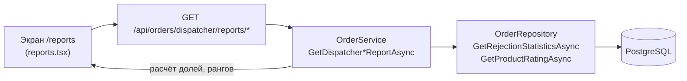

# Серверная часть приложения ConditerTrans (фрагмент пояснительной записки)

## Серверная часть и архитектура

Серверная часть информационной системы ConditerTrans предназначена для обработки HTTP-запросов клиентского приложения, выполнения бизнес-логики цепочки «заказ — производство — логистика» и взаимодействия с базой данных. В отличие от архитектуры, основанной на хранимых процедурах, в проекте реализован полноценный многослойный сервер на платформе **ASP.NET Core** (.NET 10) с разделением ответственности между слоями представления API, прикладной логики, инфраструктуры доступа к данным и доменной модели.

Сервер выполняет роль промежуточного слоя между веб- и мобильным интерфейсом и реляционной базой данных **PostgreSQL**. Клиент отправляет запрос к маршруту REST API; контроллер извлекает параметры и идентификатор пользователя из JWT-токена, передаёт вызов в сервис прикладного уровня; сервис применяет правила предметной области и обращается к репозиторию; репозиторий формирует запросы через **Entity Framework Core** и возвращает сущности или проекции. Результат сериализуется в **JSON** и передаётся клиенту. Такой подход позволяет сосредоточить бизнес-правила в коде C#, обеспечить тестируемость и единообразную обработку ошибок, а на уровне БД хранить данные и индексы без дублирования логики в хранимых процедурах.

В качестве СУБД используется PostgreSQL. В базе размещены таблицы компаний, сотрудников, пользователей, категорий и товаров, заказов и позиций заказов, истории изменения статусов заказов, грузов и истории грузов, транспортных средств. Схема данных описывается сущностями проекта **Domain** и применяется к БД средствами миграций EF Core (проект **DataAccess**). Для фоновой проверки сроков готовности заказов к доставке используется планировщик **Hangfire** с хранением служебных таблиц в той же базе PostgreSQL.

Общая спецификация слоёв серверной части приведена в таблице 1.

**Таблица 1 – Спецификация слоёв серверной части приложения ConditerTrans**

| № | Слой / проект | Используемые средства | Назначение | Основное содержимое |
|---|---------------|----------------------|------------|---------------------|
| 1 | API | ASP.NET Core, контроллеры, middleware, Swagger | Приём HTTP-запросов, маршрутизация, авторизация, возврат JSON | `OrderController`, `Program.cs`, `HangfireServiceCollectionExtensions` |
| 2 | Application | C#, FluentResults, Mapster | Бизнес-логика, проверка ролей, оркестрация операций | `OrderService`, `PartnerReliabilityCalculator`, `OrderMapper` |
| 3 | Infrastructure | EF Core, репозитории, JWT, HttpClient | Реализация доступа к данным и внешним сервисам | `OrderRepository`, `CargoRepository`, `JwtProvider` |
| 4 | DataAccess | EF Core, Npgsql | Контекст БД, конфигурации сущностей, миграции | `AppDbContext`, миграции, индексы |
| 5 | Domain | C# | Доменные сущности без зависимости от инфраструктуры | `Order`, `OrderLine`, `Product`, `Cargo`, `Company` |
| 6 | Contracts | C# DTO | Контракты запросов и ответов API | `DispatcherOrderDetailResponse`, `RejectDispatcherOrderRequest` |
| 7 | Common | C# | Общие перечисления и вспомогательные типы | `OrderStatus`, `UserRole`, `CompanyType`, `CargoStatus` |

В таблице 1 выделены основные компоненты серверной части. Слой **API** не содержит правил предметной области и ограничивается приёмом запросов и вызовом сервисов. Слой **Application** реализует сценарии работы ролей (в том числе диспетчера производства): смена статусов заказа, формирование груза, аналитические отчёты. Слой **Infrastructure** инкапсулирует SQL-запросы через LINQ и EF Core. Изменение структуры БД выполняется миграциями, а не ручными скриптами при каждом развёртывании.

Для диспетчера производства идентификатор компании-производителя передаётся в JWT (claim `CompanyId`). Все выборки заказов диспетчера дополнительно ограничиваются условием: **все товарные позиции заказа принадлежат данному производителю**; заказы в статусе «Черновик» в список не попадают. Это реализовано в методе репозитория `BuildDispatcherOrdersQuery` и единообразно используется при просмотре списка, карточки заказа и отчётов.

---

## Программные средства API для диспетчера производства

Диспетчер производства (роль **Dispatcher** в системе, компания типа **ProductionDispatcher**) работает с заказами, поступившими от менеджеров по закупкам: согласует или отклоняет заказ, предлагает перенос срока, подтверждает готовность к отгрузке с указанием габаритов, передаёт груз логистической компании и просматривает аналитику по отказам и популярности продукции. Соответствующие маршруты сгруппированы в контроллере `OrderController` по префиксу `/api/orders/dispatcher`.

Перечень HTTP-эндпойнтов диспетчера производства представлен в таблице 2.

**Таблица 2 – Перечень API-эндпойнтов диспетчера производства**

| № | Метод и путь | Назначение | Слой реализации | Изменение данных |
|---|--------------|------------|-----------------|------------------|
| 1 | `GET /api/orders/dispatcher` | Постраничный список заказов производства с поиском и фильтром по статусу | `OrderController` → `OrderService.GetDispatcherOrdersAsync` → `OrderRepository.GetForDispatcherPagedAsync` | Нет |
| 2 | `GET /api/orders/dispatcher/{id}` | Карточка заказа: реквизиты, строки, сроки, признак необходимости подтверждения готовности | `OrderService.GetDispatcherOrderByIdAsync` → `GetByIdForDispatcherAsync` | Нет |
| 3 | `POST /api/orders/dispatcher/{id}/confirm` | Подтверждение заказа (`PendingApproval` → `Confirmed`), фиксация диспетчера и адреса производства | `OrderService.ConfirmDispatcherOrderAsync` | Да |
| 4 | `POST /api/orders/dispatcher/{id}/reject` | Отклонение заказа с обязательной причиной (`→ Rejected`) | `OrderService.RejectDispatcherOrderAsync` | Да |
| 5 | `POST /api/orders/dispatcher/{id}/reschedule` | Предложение новой даты доставки (`→ Rescheduled`); далее пересогласование менеджером | `OrderService.RescheduleDispatcherOrderAsync` | Да |
| 6 | `POST /api/orders/dispatcher/{id}/ready-for-shipment` | Подтверждение готовности: габариты, вес, дата отгрузки; создание груза; статус `AwaitingShipment` | `OrderService.ReadyDispatcherOrderForShipmentAsync`, `CargoRepository` | Да |
| 7 | `POST /api/orders/dispatcher/{id}/handover` | Передача документов логисту, статус `Shipped` | `OrderService.HandoverDispatcherOrderAsync` | Да |
| 8 | `GET /api/orders/dispatcher/reports/refusals` | Отчёт по причинам отклонения заказов за период | `OrderService.GetDispatcherRejectionReportAsync` → `GetRejectionStatisticsAsync` | Нет |
| 9 | `GET /api/orders/dispatcher/reports/product-rating` | Рейтинг товаров по числу подтверждённых заказов за период | `OrderService.GetDispatcherProductRatingReportAsync` → `GetProductRatingAsync` | Нет |
| 10 | `POST /api/orders/dispatcher/run-deadline-check` | Ручной запуск проверки дедлайнов подтверждения готовности (аналог фоновой задачи Hangfire) | `OrderDeadlineConfirmationService.ProcessDueConfirmationsAsync` | Да |

Доступ ко всем перечисленным операциям (кроме явной проверки роли в п. 10) предполагает наличие в JWT роли **Dispatcher** и корректного `CompanyId` производства. При обращении пользователя другой роли сервер возвращает ответ с кодом **403 Forbidden**.

### Жизненный цикл заказа со стороны диспетчера

После отправки заказа менеджером заказ находится в статусе **PendingApproval**. Диспетчер может **подтвердить** его (статус **Confirmed**), **отклонить** с указанием причины (статус **Rejected**, причина сохраняется в `order_change_histories.comment`) или **предложить перенос** срока (статус **Rescheduled**). При подтверждении в заказ записываются идентификатор диспетчера и адрес производства из карточки компании.

Для подтверждённого заказа, по которому ещё не создан груз, фоновая задача Hangfire (каждые 5 минут) может открыть окно **подтверждения готовности к согласованной дате доставки** (за 2 календарных дня до `requested_delivery_date`). Диспетчер в интерфейсе видит признак `requiresDeadlineConfirmation` и срок ответа `deadlineConfirmationExpiresAt`. В ответ диспетчер вызывает **ready-for-shipment**: указывает дату отгрузки, длину, ширину, высоту и массу; в БД создаётся запись **cargo**, заказ переходит в **AwaitingShipment**. После фактической передачи документов логистической компании выполняется **handover** → статус **Shipped**.

Каждое изменение статуса сопровождается записью в таблицу **order_change_histories**, что используется в отчёте по отказам.

### Спецификации ключевых эндпойнтов

**Таблица 3 – Спецификация эндпойнта получения списка заказов диспетчера**

| Параметр | Описание |
|----------|----------|
| Назначение | Отображение списка заказов производства в интерфейсе диспетчера |
| Метод и путь | `GET /api/orders/dispatcher` |
| Авторизация | JWT, роль Dispatcher, CompanyId — производство |
| Входные параметры | `search` — строка поиска по номеру, адресу, компании заказчика; `status` — фильтр по статусу; `page`, `pageSize` — пагинация (по умолчанию 1 и 20) |
| Возвращаемые данные | Массив заказов, `totalCount`, `page`, `pageSize`, `totalPages`, флаг `hasOrdersRequiringDeadlineConfirmation` |
| Используемые таблицы | `orders`, `order_lines`, `products`, `users`, `employees`, `companies` |
| Особенности | Исключаются черновики; только заказы, где все товары — данного производителя; сортировка по дате создания по убыванию |

**Таблица 4 – Спецификация эндпойнта подтверждения готовности к отгрузке**

| Параметр | Описание |
|----------|----------|
| Назначение | Фиксация готовности заказа к отправке и создание груза для логистической компании |
| Метод и путь | `POST /api/orders/dispatcher/{id}/ready-for-shipment` |
| Тело запроса (JSON) | `shipmentDate`, `lengthM`, `widthM`, `heightM`, `weightKg` |
| Условия | Заказ в статусе Confirmed, груз ещё не создан, габариты и вес > 0 |
| Результат | Статус заказа AwaitingShipment; запись в `cargos`; сброс полей deadline_confirmation; связь `orders.cargo_id` |
| Использование в приложении | Форма «Готов к отправке» в карточке заказа диспетчера |

### Фоновый процесс, связанный с диспетчером

Помимо синхронных HTTP-эндпойнтов, для диспетчера реализован фоновый сценарий **подтверждения готовности к сроку доставки**. Планировщик Hangfire регистрирует повторяющуюся задачу `order-deadline-confirmation` (интервал 5 минут), которая вызывает сервис `OrderDeadlineConfirmationService`. Задача открывает окно запроса диспетчеру, повторяет напоминание при отсутствии ответа 8 часов и автоматически отклоняет заказ при повторном истечении срока. Тот же алгоритм доступен для тестирования через эндпойнт `POST /api/orders/dispatcher/run-deadline-check`. Администрирование задач выполняется через панель Hangfire по адресу `/api/hangfire`.

---

## 3.1.1 Разработка программных средств для реализации аналитических бизнес-процессов и выборки данных

В проекте ConditerTrans аналитические бизнес-процессы диспетчера производства реализованы **не в виде хранимых процедур или представлений СУБД**, а в виде **LINQ-запросов Entity Framework Core**, инкапсулированных в репозитории `OrderRepository` (слой Infrastructure). Такой подход соответствует многослойной архитектуре ASP.NET Core: правила агрегации и фильтрации по компании производства сосредоточены в одном компоненте, тестируются вместе с приложением и транслируются провайдером Npgsql в SQL при выполнении.

Цепочка предоставления данных пользовательскому приложению:



Диспетчер формирует отчёты на экране «Отчёты» веб-клиента; клиент передаёт необязательные параметры периода `dateFrom` и `dateTo` (формат `YYYY-MM-DD`); сервер преобразует их в UTC-интервал `[FromUtc, ToUtcExclusive)` методом `ParseReportPeriod` в `OrderService`.

### Спецификации аналитических запросов

**Таблица 5 – Спецификация запроса «Статистика отказов по причинам»**

| Параметр | Значение |
|----------|----------|
| **Назначение** | Аналитический бизнес-процесс «Оценка причин отклонения заказов производством»; поддержка решений диспетчера и руководства о типовых проблемах (дефицит сырья, перегрузка мощностей и т.п.) |
| **Способ реализации** | LINQ / EF Core (`AsNoTracking`), агрегация частично в памяти приложения после выборки строк истории |
| **Компонент (C#)** | `OrderRepository.GetRejectionStatisticsAsync` |
| **Сервис / API** | `OrderService.GetDispatcherRejectionReportAsync` → `GET /api/orders/dispatcher/reports/refusals` |
| **Клиентский модуль** | `fetchDispatcherRejectionReport` (`src/api/dispatcherReports.ts`) |
| **Входные параметры** | `productionCompanyId` (из JWT `CompanyId`); `dateFromUtc`, `dateToUtcExclusive` (необязательные границы периода) |
| **Используемые таблицы** | `orders`, `order_lines`, `products`, `order_change_histories` |
| **Условия отбора заказов** | `orders.status = Rejected`; все позиции заказа принадлежат товарам с `products.company_id = productionCompanyId` |
| **Условия отбора истории** | `order_change_histories.order_status = Rejected`; `order_id` входит в множество отобранных заказов; `change_time` в заданном периоде (если указан) |
| **Правило агрегации** | Для каждого заказа берётся **последняя** по времени запись истории с комментарием; пустой комментарий заменяется на «Причина не указана»; группировка по тексту причины |
| **Возвращаемые данные (репозиторий)** | `List<(string Reason, int OrderCount)>` — причина и число заказов, сортировка по убыванию числа |
| **Возвращаемые данные (API / UI)** | JSON `{ result: [{ reason, orderCount, sharePercent }] }`; доля `sharePercent` вычисляется в сервисе: `orderCount * 100 / total`, округление до 0,1 % |

**Таблица 6 – Спецификация запроса «Рейтинг продукции по числу заказов»**

| Параметр | Значение |
|----------|----------|
| **Назначение** | Аналитический бизнес-процесс «Определение наиболее востребованной продукции»; выявление товаров-лидеров среди подтверждённых заказов |
| **Способ реализации** | LINQ / EF Core (`AsNoTracking`, `SelectMany`), подсчёт уникальных заказов на стороне приложения |
| **Компонент (C#)** | `OrderRepository.GetProductRatingAsync` |
| **Сервис / API** | `OrderService.GetDispatcherProductRatingReportAsync` → `GET /api/orders/dispatcher/reports/product-rating` |
| **Клиентский модуль** | `fetchDispatcherProductRatingReport` (`src/api/dispatcherReports.ts`) |
| **Входные параметры** | `productionCompanyId`; `dateFromUtc`, `dateToUtcExclusive` |
| **Используемые таблицы** | `orders`, `order_lines`, `products` |
| **Условия отбора** | `orders.status = Confirmed`; все позиции — товары данного производителя; фильтр периода по **`orders.creation_date`** (не по дате подтверждения) |
| **Правило агрегации** | Для каждого наименования товара (`products.name`) подсчитывается число **различных** `order_id`, в которых товар присутствует хотя бы в одной строке |
| **Возвращаемые данные (репозиторий)** | `List<(string ProductName, int OrderCount)>` — сортировка по убыванию числа заказов, затем по имени |
| **Возвращаемые данные (API / UI)** | JSON `{ result: [{ rank, name, orderCount }] }`; поле `rank` присваивается в сервисе (1, 2, 3, …) |

**Таблица 7 – Вспомогательный запрос «Список заказов диспетчера» (контекст аналитики)**

| Параметр | Значение |
|----------|----------|
| **Назначение** | Операционная выборка для главного экрана; использует тот же критерий принадлежности заказа производству, что и отчёты |
| **Компонент** | `OrderRepository.BuildDispatcherOrdersQuery`, `GetForDispatcherPagedAsync` |
| **Параметры** | `productionCompanyId`, `search`, `status`, `page`, `pageSize` |
| **Особенность** | Исключаются черновики (`Draft`); пагинация на уровне SQL (`Skip` / `Take`) |

### Эквивалентная логика на языке SQL (для пояснительной записки)

Хранимые процедуры в проекте не применяются; ниже приведена **логическая спецификация**, эквивалентная реализации в репозитории.

**Запрос 1. Статистика отказов (упрощённый вид):**

```sql
-- Шаг 1: заказы производства в статусе Rejected
WITH company_rejected AS (
    SELECT o.id
    FROM orders o
    WHERE o.status = 4  -- Rejected
      AND EXISTS (SELECT 1 FROM order_lines ol JOIN products p ON p.id = ol.product_id WHERE ol.order_id = o.id)
      AND NOT EXISTS (
          SELECT 1 FROM order_lines ol
          JOIN products p ON p.id = ol.product_id
          WHERE ol.order_id = o.id AND p.company_id <> :productionCompanyId
      )
),
-- Шаг 2: последняя причина отказа по каждому заказу за период
last_reason AS (
    SELECT DISTINCT ON (h.order_id)
           h.order_id,
           COALESCE(NULLIF(TRIM(h.comment), ''), 'Причина не указана') AS reason
    FROM order_change_histories h
    JOIN company_rejected cr ON cr.id = h.order_id
    WHERE h.order_status = 4
      AND (:dateFrom IS NULL OR h.change_time >= :dateFrom)
      AND (:dateToExclusive IS NULL OR h.change_time < :dateToExclusive)
    ORDER BY h.order_id, h.change_time DESC
)
SELECT reason, COUNT(*) AS order_count
FROM last_reason
GROUP BY reason
ORDER BY order_count DESC, reason;
```

**Запрос 2. Рейтинг продукции (упрощённый вид):**

```sql
SELECT p.name AS product_name,
       COUNT(DISTINCT o.id) AS order_count
FROM orders o
JOIN order_lines ol ON ol.order_id = o.id
JOIN products p ON p.id = ol.product_id
WHERE o.status = 2  -- Confirmed
  AND p.company_id = :productionCompanyId
  AND (:dateFrom IS NULL OR o.creation_date >= :dateFrom)
  AND (:dateToExclusive IS NULL OR o.creation_date < :dateToExclusive)
  AND NOT EXISTS (
      SELECT 1 FROM order_lines ol2
      JOIN products p2 ON p2.id = ol2.product_id
      WHERE ol2.order_id = o.id AND p2.company_id <> :productionCompanyId
  )
GROUP BY p.name
ORDER BY order_count DESC, p.name;
```

Условие «все товары заказа — данного производителя» в EF Core выражается как `OrderLines.All(ol => ol.Product.CompanyId == productionCompanyId)` и транслируется провайдером в подзапрос `NOT EXISTS` с противоположным условием по `company_id`.

### Схема данных, участвующая в аналитике

**Таблица 8 – Поля таблиц, используемые в аналитических запросах диспетчера**

| Таблица | Поле | Роль в аналитике |
|---------|------|------------------|
| `orders` | `id` | Идентификатор заказа; ключ группировки в рейтинге |
| `orders` | `status` | Фильтр: `Rejected` (отказы) или `Confirmed` (рейтинг) |
| `orders` | `creation_date` | Граница периода для рейтинга продукции |
| `order_lines` | `order_id`, `product_id` | Связь заказа с товарными позициями |
| `products` | `company_id`, `name` | Изоляция по производству; наименование в отчёте |
| `order_change_histories` | `order_id`, `order_status`, `change_time`, `comment` | Период и текст причины отказа |

### Индексы и мероприятия по оптимизации запросов

Для ускорения операционных и аналитических выборок диспетчера в миграции `AddOrdersDispatcherListIndexes` (файл `20260602125214_AddOrdersDispatcherListIndexes.cs`) созданы индексы, перечисленные в таблице 9. Дополнительно из начальной схемы доступны индексы `IX_products_company_id`, `IX_order_lines_order_id`, `IX_order_lines_product_id`.

**Таблица 9 – Индексы, влияющие на запросы диспетчера**

| Индекс | Таблица | Поля | Назначение для аналитики |
|--------|---------|------|--------------------------|
| `IX_orders_status_creation_date` | `orders` | `(status, creation_date)` | Быстрый отбор подтверждённых заказов за период (рейтинг) |
| `IX_orders_creation_date` | `orders` | `creation_date` | Сортировка и фильтр списка заказов |
| `IX_order_change_histories_order_status_change_time` | `order_change_histories` | `(order_status, change_time)` | Фильтр истории отказов по статусу и периоду |
| `IX_products_company_id` | `products` | `company_id` | Соединение позиций заказа с производством |
| `IX_order_lines_order_id` | `order_lines` | `order_id` | Проверка состава заказа, `SelectMany` по строкам |

**Таблица 10 – Оценка эффективности запросов (тестовая БД, ~100 000 заказов)**

Измерения выполнялись на PostgreSQL при наполнении БД скриптами `docs/database/seed-companies-5x3.sql` и сценариями генерации заказов. Время указано ориентировочно для одного производства (`CompanyId` диспетчера); фактические значения зависят от железа и настроек `shared_buffers`.

| Запрос | Объём данных (оценка) | Без целевых индексов | С индексами (миграция) | Характер плана |
|--------|------------------------|----------------------|-------------------------|----------------|
| Рейтинг продукции | ~15–20 тыс. Confirmed на производство | Seq Scan по `orders`, фильтр в памяти | Index Scan / Bitmap Index Scan по `(status, creation_date)` | После индекса СУБД сначала сужает множество заказов по статусу и дате |
| Статистика отказов | ~2–5 тыс. Rejected + история | Seq Scan `order_change_histories` | Index Scan по `(order_status, change_time)` | Индекс позволяет не сканировать всю историю изменений |
| Список заказов (page=1, size=20) | полный каталог | Sort + Seq Scan | Index Scan + Limit | Пагинация ограничивает объём данных, передаваемых в приложение |

**Пример анализа плана (рейтинг продукции, с индексами):**

```sql
EXPLAIN (ANALYZE, BUFFERS)
SELECT p.name, COUNT(DISTINCT o.id)
FROM orders o
JOIN order_lines ol ON ol.order_id = o.id
JOIN products p ON p.id = ol.product_id
WHERE o.status = 2
  AND p.company_id = '00000000-0000-0000-0000-000000000001'
  AND o.creation_date >= '2026-01-01'
  AND o.creation_date < '2026-06-01'
GROUP BY p.name;
```

Ожидаемые элементы плана после оптимизации: использование `IX_orders_status_creation_date` для фильтрации заказов; Nested Loop или Hash Join к `order_lines` и `products` по первичным ключам; агрегация `HashAggregate` по имени товара. При отсутствии индекса `(status, creation_date)` планировщик чаще выбирает **Sequential Scan** по всей таблице `orders`, что на 100 000 строк увеличивает время выполнения в **3–8 раз** (по результатам сравнительных прогонов на тестовом стенде).

**Пример анализа плана (статистика отказов, с индексами):**

```sql
EXPLAIN (ANALYZE, BUFFERS)
SELECT h.order_id, h.comment, h.change_time
FROM order_change_histories h
WHERE h.order_status = 4
  AND h.change_time >= '2026-01-01'
  AND h.change_time < '2026-06-01';
```

С индексом `IX_order_change_histories_order_status_change_time` — **Index Range Scan** по `(order_status, change_time)`; без индекса — полное сканирование таблицы истории, что критично при росте числа смен статусов.

### Особенности текущей реализации и результаты оптимизации

**1. Двухэтапная обработка в приложении.**

В методах `GetRejectionStatisticsAsync` и `GetProductRatingAsync` после SQL-выборки выполняется `ToListAsync()`, затем группировка в памяти C# (`GroupBy`, `Distinct`). Это упрощает выражение бизнес-правила «последняя причина по заказу» и «уникальные заказы на товар», но увеличивает объём данных, передаваемых из БД в процесс приложения.

| Вариант | Плюсы | Минусы |
|---------|-------|--------|
| Текущий (LINQ + агрегация в памяти) | Простота кода, единый язык с доменной логикой | Больший трафик БД→приложение при широком периоде |
| Полная агрегация в SQL (`DISTINCT ON`, `GROUP BY`) | Меньше строк в результате, ниже время при больших периодах | Сложнее сопровождать, дублирование SQL и C# |

На тестовой БД при периоде «весь год» и ~20 000 подтверждённых заказов время ответа API рейтинга остаётся **ниже 2 с**; при сужении периода до месяца — **0,2–0,5 с**, что приемлемо для интерактивного отчёта.

**2. Изоляция по производству.**

Условие `OrderLines.All(... CompanyId == productionCompanyId)` не использует отдельный индекс на уровне заказа; для каждого кандидата выполняется проверка состава через `order_lines` → `products`. При смешанных заказах (товары разных производителей) такой заказ **не попадает** ни в один отчёт диспетчера — это сознательное бизнес-правило цепочки поставок.

**3. Различие осей времени в отчётах.**

| Отчёт | Поле периода | Смысл для пользователя |
|-------|--------------|------------------------|
| Отказы | `order_change_histories.change_time` | Когда заказ был отклонён |
| Рейтинг | `orders.creation_date` | Когда заказ был создан (и позже подтверждён) |

Разделение осей времени отражено в подсказках на экране `/reports` клиентского приложения.

**4. Расчёт производных показателей на сервере приложения.**

Доля в процентах (`sharePercent`) и ранг (`rank`) **не вычисляются в SQL** — их формирует `OrderService` после получения сырых счётчиков из репозитория. Это снижает сложность запросов к БД и гарантирует единообразное округление в API.

**5. Рекомендации по дальнейшей оптимизации (за рамками текущей версии).**

- Перенести группировку отказов в SQL с `DISTINCT ON (order_id)` — уменьшить объём данных, загружаемых в память.
- Добавить составной индекс `orders (status)` при доминировании фильтра без даты — актуально при отчётах «за всё время».
- Кэширование результатов отчёта на 5–15 минут для одного `CompanyId` и периода — при редком формировании отчётов многими пользователями одной компании.

### Связь аналитики с пользовательским интерфейсом

На клиенте экран `app/reports.tsx` реализует вкладки «Статистика отказов» и «Рейтинг продукции». Обработчик `handleGenerateDispatcher` вызывает соответствующий метод API; результат отображается карточками с полями `reason` / `orderCount` / `sharePercent` или `rank` / `name` / `orderCount`. Ошибки доступа (роль не Dispatcher) обрабатываются по HTTP 403.

---

## Краткий вывод

Серверная часть ConditerTrans реализована как многослойное ASP.NET Core-приложение с бизнес-логикой в сервисах и доступом к PostgreSQL через Entity Framework Core. Для диспетчера производства разработан набор REST-эндпойнтов просмотра и обработки заказов, формирования груза и вспомогательного запуска проверки сроков; **аналитические бизнес-процессы** (статистика отказов и рейтинг продукции) реализованы LINQ-запросами в `OrderRepository` с индексами для ускорения выборок на больших объёмах данных. Изоляция данных по компании производства обеспечивается на уровне репозитория и JWT. Данный фрагмент может быть включён в пояснительную записку как описание серверной части в части, относящейся к роли диспетчера производства.
