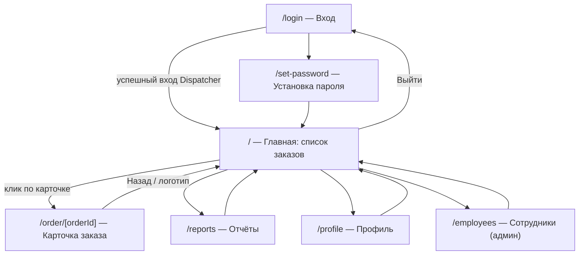
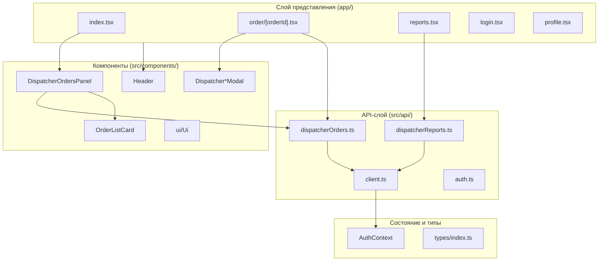
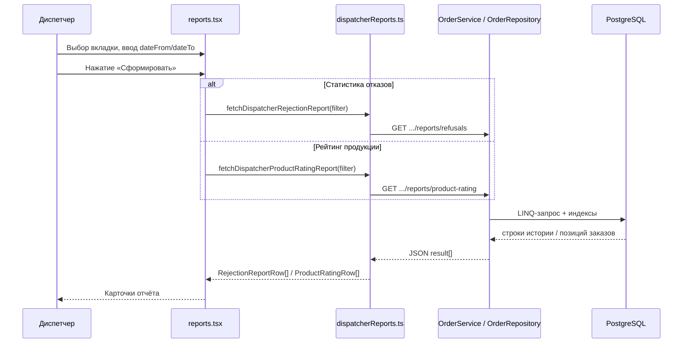

# 3.2 Разработка клиентской части приложения (веб-интерфейс диспетчера производства)

Клиентская часть информационной системы ConditerTrans реализована как кроссплатформенное веб-приложение на базе **React 19**, **React Native Web** и **Expo Router 6**. Для диспетчера производства интерфейс обеспечивает просмотр и обработку заказов, формирование отчётов и управление учётной записью. Взаимодействие с серверной частью выполняется по REST API; токен доступа JWT хранится локально и автоматически добавляется к каждому запросу.

---

## 3.2.1 Разработка пользовательского интерфейса клиентского приложения

### Назначение интерфейса диспетчера

Пользовательский интерфейс диспетчера производства предназначен для:

- просмотра поступивших заказов от менеджеров по закупкам и фильтрации по статусу;
- принятия решения по заказу: подтверждение, отказ, перенос срока;
- подтверждения готовности к отгрузке с указанием габаритов и массы груза;
- фиксации передачи документов логистической компании;
- формирования аналитических отчётов по отказам и рейтингу продукции;
- управления профилем и (для администратора компании) сотрудниками.

Доступ к функциям ограничивается ролью **Dispatcher**, определяемой после авторизации и хранящейся в контексте `AuthContext`.

### Навигационная схема пользовательского интерфейса

Навигация построена на **файловом маршрутизаторе Expo Router** (каталог `app/`). Переходы между экранами выполняются без полной перезагрузки страницы (SPA-поведение в веб-сборке).



**Таблица 7 – Экраны и переходы интерфейса диспетчера производства**

| № | Маршрут | Наименование экрана | Способ перехода | Функциональный блок |
|---|---------|---------------------|-----------------|---------------------|
| 1 | `/login` | Авторизация | Прямой URL, редирект при отсутствии токена | Вход в систему |
| 2 | `/` | Список заказов | Пункт «Заказы» в шапке, логотип | Обработка заказов |
| 3 | `/order/[orderId]` | Карточка заказа | Клик по карточке в списке | Детали и действия по заказу |
| 4 | `/reports` | Отчёты диспетчера | Пункт «Отчёты» в шапке | Аналитика |
| 5 | `/profile` | Профиль пользователя | Пункт «Профиль», аватар на детальном экране | Учётная запись |
| 6 | `/employees` | Сотрудники | Пункт «Сотрудники» (только `isAdmin`) | Администрирование персонала |

**Пояснения к навигационной схеме.**

1. После успешной авторизации диспетчер попадает на главный экран `/`. В зависимости от роли в `app/index.tsx` отображается компонент `DispatcherOrdersPanel`, а не интерфейсы менеджера, координатора или водителя.

2. Шапка приложения (`Header`) на основных экранах содержит горизонтальное меню: **Заказы**, **Отчёты**, **Профиль**, а для администратора — **Сотрудники**. На экране карточки заказа (`variant="trip"`) вместо меню отображается кнопка **«← Назад»**, возвращающая на главную.

3. Экран `/order/[orderId]` доступен только пользователю с ролью Dispatcher; иначе выполняется редирект на `/`.

4. Экран `/reports` для диспетчера показывает вкладки «Статистика отказов» и «Рейтинг продукции»; координатору на том же маршруте показывается иной отчёт (вне scope данного раздела).

5. Выход из системы очищает токены в `AsyncStorage` и перенаправляет на `/login`.

### Визуальные прототипы окон и комментарии

Ниже приведены текстовые описания прототипов основных окон. Полный набор макетов может быть вынесен в приложение к пояснительной записке (скриншоты веб-сборки `npm run web`).

**Окно 1. Авторизация (`/login`)**

- Центрированная форма: поля «Электронная почта» и «Пароль», кнопка «Войти».
- При ошибке — сообщение под формой.
- После входа диспетчер перенаправляется на список заказов.

**Окно 2. Список заказов — главная (`/`)**

- Верхняя панель: логотип «КондитерТранс», навигация, кнопка «Выйти».
- Заголовок раздела «Список заказов».
- При наличии заказов с дедлайном подтверждения — жёлтый информационный баннер: «Есть заказы, по которым нужно подтвердить готовность к сроку…».
- Строка поиска и кнопка «Найти» (поиск по коду, компании, адресу).
- Блок пагинации: диапазон записей, переключатель размера страницы (20 / 50 / 100), кнопки страниц.
- Сетка карточек заказов (`OrderListCard`): код заказа, цветной бейдж статуса, заказчик, даты, адрес, сумма, ссылка «Открыть карточку».
- Ссылка «Обновить список»; фоновое автообновление каждые 30 секунд.

**Окно 3. Карточка заказа (`/order/[orderId]`)**

- Шапка с кнопкой «Назад».
- Заголовок: код заказа, название компании-заказчика, бейдж статуса.
- При `requiresDeadlineConfirmation` — красный/оранжевый баннер с требованием указать габариты или перенести срок.
- Блок «Информация о заказе»: даты, адреса, оплата, сумма, габариты (если уже указаны).
- Блок «Пересогласование сроков» (для статуса Rescheduled).
- Таблица состава заказа (наименование, количество).
- Блок «Действия диспетчера» — кнопки в зависимости от статуса (см. таблицу 8).
- Модальные окна для ввода причины отказа, даты переноса, габаритов груза, подтверждения передачи документов.

**Таблица 8 – Доступные действия на карточке заказа**

| Статус заказа | Кнопки в интерфейсе |
|---------------|---------------------|
| Ожидает подтверждения | Принять заказ; Отказать; Срыв сроков производства |
| Пересогласование | Срыв сроков производства |
| Подтверждён | Подтвердить готовность; Срыв сроков производства |
| Готов к отправке | Фиксировать отгрузку |
| Прочие | Сообщение «нет доступных действий» |

**Окно 4. Отчёты диспетчера (`/reports`)**

- Переключатель вкладок: «Статистика отказов» / «Рейтинг продукции».
- Пояснительный текст к выбранному отчёту.
- Поля периода «с» и «по» (формат YYYY-MM-DD).
- Кнопка «Сформировать».
- Список карточек результата: для отказов — причина, число заказов, доля %; для рейтинга — ранг, название товара, число заказов.

**Окно 5. Профиль (`/profile`)**

- Данные пользователя, смена пароля (общий экран для всех ролей).

**Окно 6. Сотрудники (`/employees`)** — при `isAdmin`

- Список сотрудников компании-производства, создание приглашений (роль Dispatcher и др.).

**Единый визуальный стиль**

- Цветовая схема в `src/theme/colors.ts`: фон, поверхности карточек, основной акцент, цвет ошибки.
- Компоненты `Button`, `Input`, `SectionTitle` — единообразие форм.
- Статусы заказов — цветные бейджи `OrderStatusBadge` с подписями из `dispatcherOrderStatus.ts`.

---

## 3.2.2 Разработка программного обеспечения клиентской части

### Структура приложения и иерархия модулей

Клиентское приложение организовано по принципу **разделения экранов, компонентов, API-слоя и типов данных**.



**Таблица 9 – Спецификация модулей клиентской части (диспетчер)**

| № | Модуль / каталог | Технология | Назначение | Ключевые файлы |
|---|------------------|------------|------------|----------------|
| 1 | `app/` | Expo Router | Маршруты и экраны-контейнеры | `index.tsx`, `order/[orderId].tsx`, `reports.tsx` |
| 2 | `src/components/Dispatcher/` | React Native | Логика списка заказов диспетчера | `DispatcherOrdersPanel.tsx`, `DispatcherPagination.tsx` |
| 3 | `src/components/Order/` | React Native | Отображение заказа | `OrderListCard.tsx`, `OrderStatusBadge.tsx` |
| 4 | `src/components/Modal/` | React Native | Диалоги ввода данных действий | `DispatcherRejectModal.tsx`, `DispatcherReadyForShipmentModal.tsx` и др. |
| 5 | `src/api/` | TypeScript, fetch | HTTP-клиент и вызовы REST API | `dispatcherOrders.ts`, `dispatcherReports.ts`, `client.ts` |
| 6 | `src/types/` | TypeScript | Контракты данных UI | `DispatcherOrderDetail`, `PaginatedDispatcherOrders` |
| 7 | `src/context/` | React Context | Авторизация и роль | `AuthContext.tsx` |
| 8 | `src/theme/` | StyleSheet | Оформление | `colors.ts` |

Корневой layout `app/_layout.tsx` оборачивает приложение в `AuthProvider` и регистрирует стек экранов без системного заголовка (`headerShown: false`), так как навигация реализована кастомным компонентом `Header`.

### Система классов и структур данных

Типы данных для диспетчера сосредоточены в `src/types/index.ts` и дополняются маппингом в API-модулях.

**Таблица 10 – Основные структуры данных (диспетчер)**

| Тип | Назначение | Ключевые поля |
|-----|------------|---------------|
| `DispatcherOrderStatus` | Статус заказа в UI | `PendingApproval`, `Confirmed`, `Rescheduled`, … |
| `DispatcherOrderListItem` | Элемент списка | `id`, `orderNumber`, `status`, `companyName`, `requestedDeliveryDate`, `requiresDeadlineConfirmation` |
| `DispatcherOrderDetail` | Карточка заказа | наследует list item + `lines[]`, `productionAddress`, `shipmentLengthM`, … |
| `DispatcherOrderLine` | Строка заказа | `productName`, `quantity`, `formattedQuantity`, `productPrice` |
| `PaginatedDispatcherOrders` | Страница списка | `items`, `total`, `page`, `pageSize`, `totalPages`, `hasOrdersRequiringDeadlineConfirmation` |
| `RejectDispatcherOrderDto` | Тело отказа | `reason` |
| `RescheduleDispatcherOrderDto` | Тело переноса | `newDeliveryDate`, `reason` |
| `ReadyForShipmentDto` | Готовность к отгрузке | `shipmentDate`, `lengthM`, `widthM`, `heightM`, `weightKg` |
| `RejectionReportRow` / `ProductRatingRow` | Строки отчётов | причина и доля / ранг и имя товара |

Модуль `dispatcherOrders.ts` выполняет **преобразование ответа API** (`ApiDispatcherOrder`) в типы интерфейса: нормализация имён полей, вычисление подписи кода заказа (`formatOrderCode`), форматирование дат для отображения.

### Алгоритмы работы ключевых методов и обработчиков

**Таблица 11 – Алгоритмы ключевых функций клиентской части диспетчера**

| Функция / обработчик | Файл | Алгоритм |
|----------------------|------|----------|
| `loadOrders` | `DispatcherOrdersPanel.tsx` | 1) Сброс ошибки; 2) `fetchDispatcherOrders({ search, page, pageSize })`; 3) пересчёт `totalPages`; 4) при 403 — сообщение о правах |
| Автообновление списка | `DispatcherOrdersPanel.tsx` | `setInterval(30_000)` вызывает `loadOrders` при изменении фильтров |
| `getAvailableDispatcherActions` | `dispatcherOrderStatus.ts` | По `status` возвращает массив допустимых действий (конечный автомат UI) |
| `loadOrder` | `order/[orderId].tsx` | GET `/api/orders/dispatcher/{id}`; при 404 — «Заказ не найден» |
| `useFocusEffect` | `order/[orderId].tsx` | При возврате на экран — повторная загрузка карточки |
| Эффект дедлайна | `order/[orderId].tsx` | Если `requiresDeadlineConfirmation` и баннер ещё не показывали — открыть модалку готовности |
| `refreshAfterAction` | `order/[orderId].tsx` | Вызов POST-метода API → обновление локального `order` без полной перезагрузки страницы |
| `handleConfirm` | `order/[orderId].tsx` | `confirmAction` (диалог) → `confirmDispatcherOrder` |
| `runAction` | `order/[orderId].tsx` | Маршрутизация: confirm — сразу API; остальные — открытие модалки |
| `apiRequest` | `client.ts` | Добавление `Authorization: Bearer`; разбор JSON; выброс `ApiError` с текстом сервера |
| `handleGenerateDispatcher` | `reports.tsx` | По вкладке — `fetchDispatcherRejectionReport` или `fetchDispatcherProductRatingReport` с `dateFrom`/`dateTo` |

### Аналитические бизнес-процессы в клиентской части

Клиентская часть не выполняет агрегацию данных самостоятельно: экран отчётов является **представлением (presentation layer)** для результатов серверных аналитических запросов (раздел **3.1.1** backend-документа). Вся выборка, фильтрация по компании производства и подсчёт показателей выполняются в `OrderRepository`; клиент отвечает за ввод периода, вызов API и визуализацию.



**Таблица 11a – Спецификация клиентских модулей аналитики**

| Модуль | Назначение | Параметры | Отображаемые поля |
|--------|------------|-----------|-------------------|
| `app/reports.tsx` | UI отчётов: вкладки, период, кнопка формирования, список карточек | `dateFrom`, `dateTo` (строки `YYYY-MM-DD`, необязательны) | см. ниже |
| `fetchDispatcherRejectionReport` | HTTP-клиент отчёта по отказам | `ReportDateFilter` → query `?dateFrom&dateTo` | `reason`, `orderCount`, `sharePercent` |
| `fetchDispatcherProductRatingReport` | HTTP-клиент рейтинга продукции | тот же фильтр | `rank`, `name`, `orderCount` |
| `buildQuery` | Формирование query string | только непустые даты | — |
| `mapRejectionRow` / `mapRatingRow` | Нормализация camelCase / PascalCase от API | — | совместимость с сериализацией ASP.NET |

**Таблица 11b – Алгоритм формирования отчёта на клиенте (`handleGenerateDispatcher`)**

| Шаг | Действие |
|-----|----------|
| 1 | Собрать объект `ReportDateFilter` из полей ввода |
| 2 | Установить `loading = true`, очистить предыдущую ошибку |
| 3 | По активной вкладке (`refusals` / `rating`) вызвать соответствующий `fetch*` |
| 4 | При успехе: записать строки в `refusalRows` или `ratingRows`, `generated = true` |
| 5 | При ошибке 403 — «Недостаточно прав»; иначе — текст исключения |
| 6 | Очистить массив **другой** вкладки, чтобы не показывать устаревшие данные |
| 7 | `loading = false` |

**Таблица 11c – Семантика отчётов для пользователя (подсказки UI)**

| Вкладка | Текст подсказки в интерфейсе | Интерпретация данных |
|---------|------------------------------|----------------------|
| Статистика отказов | «Учитываются заказы со статусом „Отклонён“ за выбранный период…» | Период — по дате **отклонения** (история статусов); группировка по последней причине |
| Рейтинг продукции | «Топ товаров по числу подтверждённых заказов…» | Учитываются заказы в статусе **Confirmed**; период — по **дате создания** заказа; один заказ с несколькими позициями одного товара считается один раз |

**Таблица 11d – Структуры данных отчётов (TypeScript)**

| Тип | Поля | Источник |
|-----|------|----------|
| `ReportDateFilter` | `dateFrom: string`, `dateTo: string` | Ввод пользователя |
| `RejectionReportRow` | `reason`, `orderCount`, `sharePercent` | API; `sharePercent` рассчитывается на сервере |
| `ProductRatingRow` | `rank`, `name`, `orderCount` | API; `rank` присваивается на сервере |

Пустой результат не считается ошибкой: клиент выводит сообщения «За период отказов не найдено» или «За период подтверждённых заказов не найдено».

**Особенности UX аналитики**

- Переключение вкладки сбрасывает флаг `generated`, чтобы пользователь явно нажал «Сформировать» для нового типа отчёта.
- Период необязателен: при пустых полях запрос уходит без query-параметров, сервер возвращает данные **за всё время** (с учётом фильтра по компании производства).
- Клиент не кэширует отчёты между сеансами; каждое формирование — новый запрос к API (актуальные данные после обработки заказов).

Подробные спецификации SQL/LINQ-запросов, индексов и результатов `EXPLAIN ANALYZE` приведены в документе `docs/poyasnitelnaya-zapiska-backend-dispatcher.md`, раздел **3.1.1**.

**Диаграмма состояний действий диспетчера (логика UI)**
stateDiagram-v2
    [*] --> PendingApproval: заказ от менеджера
    PendingApproval --> Confirmed: Принять заказ
    PendingApproval --> Rejected: Отказать
    PendingApproval --> Rescheduled: Срыв сроков
    Rescheduled --> Rescheduled: повторный перенос
    Confirmed --> AwaitingShipment: Подтвердить готовность
    Confirmed --> Rescheduled: Срыв сроков
    AwaitingShipment --> Shipped: Фиксировать отгрузку
    Rejected --> [*]
    Shipped --> [*]
```

Логика на клиенте **дублирует допустимые переходы** для отображения кнопок; окончательная проверка выполняется на сервере при POST-запросе.

### Взаимодействие с серверным API

**Таблица 12 – Соответствие функций клиента и эндпойнтов API**

| Функция клиента | HTTP-запрос |
|-----------------|-------------|
| `fetchDispatcherOrders` | `GET /api/orders/dispatcher?search&status&page&pageSize` |
| `fetchDispatcherOrderById` | `GET /api/orders/dispatcher/{id}` |
| `confirmDispatcherOrder` | `POST /api/orders/dispatcher/{id}/confirm` |
| `rejectDispatcherOrder` | `POST /api/orders/dispatcher/{id}/reject` |
| `rescheduleDispatcherOrder` | `POST /api/orders/dispatcher/{id}/reschedule` |
| `readyDispatcherOrderForShipment` | `POST /api/orders/dispatcher/{id}/ready-for-shipment` |
| `handoverDispatcherOrder` | `POST /api/orders/dispatcher/{id}/handover` |
| `fetchDispatcherRejectionReport` | `GET /api/orders/dispatcher/reports/refusals` |
| `fetchDispatcherProductRatingReport` | `GET /api/orders/dispatcher/reports/product-rating` |

### Авторизация и хранение сеанса

1. При запуске `AuthProvider` читает токены из `AsyncStorage` (`tokenStorage.ts`).
2. При наличии токена выполняется `refreshAuthProfile` для актуализации роли и `isAdmin`.
3. Каждый запрос через `apiRequest` подставляет заголовок `Authorization`.
4. При `logout` токены удаляются, контекст обнуляется, роутер переводит на `/login`.

Диспетчер не выбирает компанию вручную: **CompanyId производства** зашит в JWT на сервере при выдаче токена.

### Сборка и запуск веб-клиента

| Средство | Назначение |
|----------|------------|
| Expo SDK 54 | Среда разработки и сборки |
| `expo start --web` | Запуск веб-версии в браузере |
| `scripts/use-env.mjs` | Переключение `development` / `production` и базового URL API |
| `src/config/env.ts` | Чтение `EXPO_PUBLIC_API_URL` |

Исходные коды клиентского приложения (каталоги `app/`, `src/`) выносятся в соответствующее приложение к пояснительной записке.

### Вывод по разделу 3.2

Клиентская часть для диспетчера производства реализована как одностраничное веб-приложение с маршрутизацией Expo Router, компонентной структурой React и выделенным API-слоем. Пользовательский интерфейс охватывает полный цикл обработки заказа от списка до отгрузки, поддерживает пагинацию, поиск, оповещение о дедлайнах и аналитические отчёты. Бизнес-правила отображения действий инкапсулированы в `getAvailableDispatcherActions`, а обмен данными с сервером — в модулях `dispatcherOrders.ts` и `dispatcherReports.ts`.
